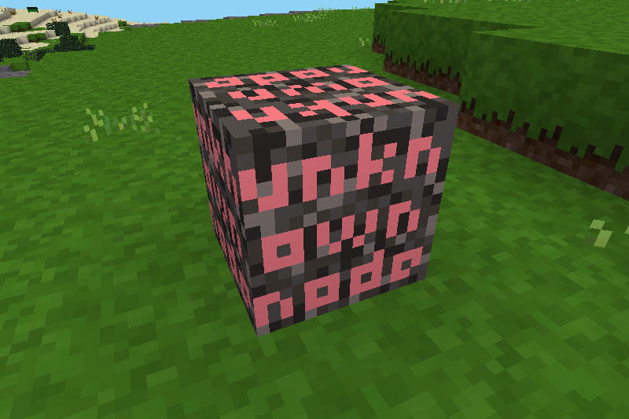

## Cleaner mod for Minetest

### Description:

A [Minetest][] mod that can be used to remove/replace unknown entities, nodes, & items. Originally forked from [PilzAdam's ***clean*** mod][f.pilzadam].



### Licensing:

- Code: [MIT](LICENSE.txt)
- Textures: CC0

### Requirements:

- Minetest minimum version: 5.0
- Depends: none

### Usage:

Registering items, entities, etc. for cleaning can be done in `cleaner.json` in the world directory. If it does not exist it will be created automatically when the server is started.

It is formatted as follows:
```json
{
	"entities" :
	{
		"remove" : []
	},
	"items" :
	{
		"replace" : {}
	},
	"nodes" :
	{
		"remove" : [],
		"replace" : {}
	},
	"ores" :
	{
		"remove" : []
	}
}
```

Cleaning nodes example:
```json
{
	"nodes" :
	{
		"remove" : [
			"old:node_1",
			"old:node_2",
		],
		"replace" : {
			"old:node_3" : "new:node_1",
			"old:node_4" : "new:node_2",
		}
	},
}
```

`remove` key works for nodes, entities, & ores. `replace` key works for nodes & items. Their functions are self-explanatory.

#### Settings:

```
cleaner.unsafe
- Enables unsafe methods & commands (remove_ore).
- type:    bool
- default: false
```

### Links:

- [][ContentDB]
- [Forum](https://forum.minetest.net/viewtopic.php?t=18381)
- [Git repo](https://github.com/AntumMT/mod-cleaner)
- [Reference](https://antummt.github.io/mod-cleaner/reference/latest/)
- [Changelog](changelog.txt)
- [TODO](TODO.txt)


[Minetest]: http://www.minetest.net/
[f.pilzadam]: https://forum.minetest.net/viewtopic.php?t=2777
[ContentDB]: https://content.minetest.net/packages/AntumDeluge/cleaner/
